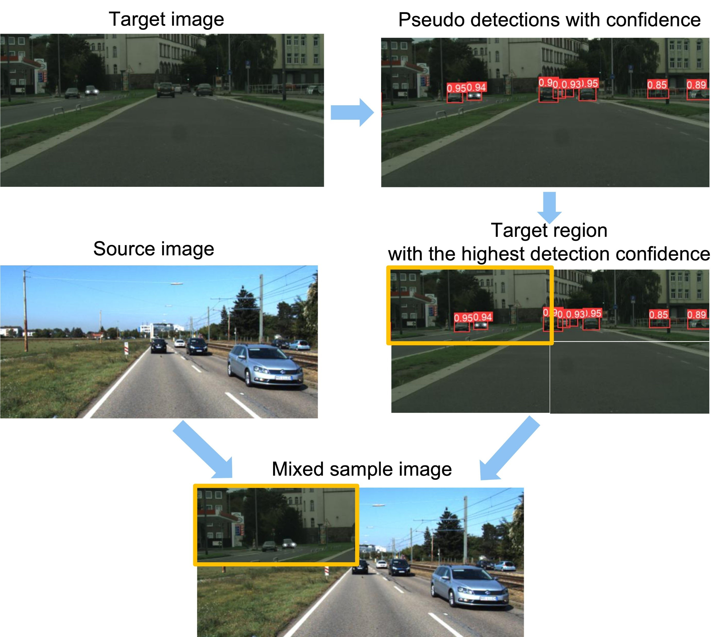

# ConfMix: Unsupervised Domain Adaptation for Object Detection via Confidence-based Mixing

<p align="center">
  
</p>
<br>

> **ConfMix: Unsupervised Domain Adaptation for Object Detection via Confidence-based Mixing**<br>
> Giulio Mattolin, Luca Zanella, [Yiming Wang](https://www.yimingwang.it/), [Elisa Ricci](http://elisaricci.eu/) <br>
> **WACV 2023**

> Paper: [ArXiv](https://arxiv.org/abs/2210.11539) <br>

> **Abstract:** *Unsupervised Domain Adaptation (UDA) for object detection aims to adapt a model trained on a source domain to detect instances from a new target domain for which annotations are not available.
Different from traditional approaches, we propose ConfMix, the first method that introduces a sample mixing strategy based on region-level detection confidence for adaptive object detector learning. We mix the local region of the target sample that corresponds to the most confident pseudo detections with a source image, and apply an additional consistency loss term to gradually adapt towards the target data distribution. In order to robustly define a confidence score for a region, we exploit the confidence score per pseudo detection that accounts for both the detector-dependent confidence and the bounding box uncertainty.
Moreover, we propose a novel pseudo labelling scheme that progressively filters the pseudo target detections using the confidence metric that varies from a loose to strict manner along the training. We perform extensive experiments with three datasets, achieving state-of-the-art performance in two of them and approaching the supervised target model performance in the other.*

# Installation

We recommend the use of a Linux machine equipped with CUDA compatible GPUs.
The execution environment can be installed through Conda or Docker.

Clone repo:
```bash
git clone https://github.com/giuliomattolin/ConfMix  # clone
cd ConfMix
```

## Option 1: Conda

Install requirements.txt in a
[**Python>=3.7.0**](https://www.python.org/) environment, including
[**PyTorch>=1.7**](https://pytorch.org/get-started/locally/). The environment can be installed and activated with:

```bash
conda create --name ConfMix python=3.7
conda activate ConfMix
pip install -r requirements.txt  # install
```

## Option 2: Docker

Use the Dockerfile to build the docker image:

```bash
docker build -t confmix:1.0 -f utils/docker/Dockerfile .
```

Run the docker image mounting the root directory to `/usr/src/app` in the docker container:

```bash
docker run -it --gpus all --ipc=host -v /path/to/directory/ConfMix:/usr/src/app confmix:1.0 /bin/bash
```

# Dataset

We construct the training and testing set for the three benchmark settings, by performing the following steps:

- Cityscapes -> Foggy Cityscapes
  - Download Cityscapes and Foggy Cityscapes dataset from the following [link](https://www.cityscapes-dataset.com/downloads/). Particularly, we use *leftImg8bit_trainvaltest.zip* for Cityscapes and *leftImg8bit_trainvaltest_foggy.zip* for FoggyCityscapes, considering only images with $\beta$ = 0.02.
  - Download and extract the converted annotation from the following links: [Cityscapes (YOLO format)](https://drive.google.com/file/d/1bwnNJraKO7ui1Kvl1kPVKdW6xafy1-sr/view?usp=sharing) and [Foggy Cityscapes (YOLO format)](https://drive.google.com/drive/folders/1nTtNXPNCUD7aDQAT3SLgc4kqfL7S-xX7?usp=sharing) move the them to `Cityscapes/labels/train` and `FoggyCityscapes/labels/train`, `FoggyCityscapes/labels/val` directories.
  - Extract the training sets from *leftImg8bit_trainvaltest.zip*, then move the folder `leftImg8bit/train/` to `Cityscapes/images/train` directory.
  - Extract the training and validation set from *leftImg8bit_trainvaltest_foggy.zip*, then move the folder `leftImg8bit_foggy/train/` and `leftImg8bit_foggy/val/` to `FoggyCityscapes/images/train` and `FoggyCityscapes/images/val` directory, respectively.
- Sim10k -> Cityscapes (car category only)
  - Download Sim10k dataset and Cityscapes dataset from the following links: [Sim10k](https://fcav.engin.umich.edu/projects/driving-in-the-matrix) and [Cityscapes](https://www.cityscapes-dataset.com/downloads/). Particularly, we use *repro_10k_images.tgz* and *repro_10k_annotations.tgz* for Sim10k and *leftImg8bit_trainvaltest.zip* for Cityscapes.
  - Download and extract the converted annotation from the following links: [Sim10k (YOLO format)](https://drive.google.com/file/d/1_PtWXTjM2gwNjLvj9sFLiCJ7n25b8Ugy/view?usp=sharing) and [Cityscapes (YOLO format)](https://drive.google.com/drive/folders/1jQK1mXEgSUvINJBn3lMEWtXTS4RkoznW?usp=sharing) and move the them to `Sim10K/labels/train` and `Cityscapes/labels/train`, `Cityscapes/labels/val` directories.
  - Extract the training set from *repro_10k_images.tgz* and *repro_10k_annotations.tgz*, then move all images under `VOC2012/JPEGImages/` to `Sim10k/images/train` directory
  - Extract the training and validation set from *leftImg8bit_trainvaltest.zip*, then move the folder `leftImg8bit/train/` and `leftImg8bit/val/` to `Cityscapes/images/train` and `Cityscapes/images/val` directory, respectively.
- KITTI -> Cityscapes (car category only)
  - Download KITTI dataset and Cityscapes dataset from the following links: [KITTI](http://www.cvlibs.net/datasets/kitti/eval_object.php?obj_benchmark=2d) and [Cityscapes](https://www.cityscapes-dataset.com/downloads/). Particularly, we use *data_object_image_2.zip* for KITTI and *leftImg8bit_trainvaltest.zip* for Cityscapes.
  - Download and extract the converted annotation from the following links: [KITTI (YOLO format)](https://drive.google.com/file/d/1x9MPnKiwvCFmEv4359NSTDYLEGu5wb_8/view?usp=sharing) and [Cityscapes (YOLO format)](https://drive.google.com/drive/folders/1jQK1mXEgSUvINJBn3lMEWtXTS4RkoznW?usp=sharing) and move the them to `KITTI/labels/train` and `Cityscapes/labels/train`, `Cityscapes/labels/val` directories.
  - Extract the training set from *data_object_image_2.zip*, then move all images under `training/image_2/` to `KITTI/images/train` directory.
  - Extract the training and validation set from *leftImg8bit_trainvaltest.zip*, then move the folder `leftImg8bit/train/` and `leftImg8bit/val/` to `Cityscapes/images/train` and `Cityscapes/images/val` directory, respectively.

# Pretrained models

Pretrained models are available from [Google Drive](https://drive.google.com/drive/folders/10UMRZNmYtBnRp_LNgq3oL97iA0v4VFfE?usp=sharing).

# Training

To reproduce the experimental result, we recommend training the model with the following steps.

Before training, please check `data/Cityscapes2Foggy.yaml`, `data/Sim10K2Cityscapes.yaml`, `data/KITTI2Cityscapes.yaml`, and enter the correct data paths.

The model is trained in 2 successive phases:
- **Phase 1**: Model pre-train
- **Phase 2**: Adaptive learning

## Phase 1: Model pre-train
The first phase of training consists in the pre-training of the model on the source domain. Training can be performed by running the following bash script:

Cityscapes -> Foggy Cityscapes:

```bash
python train.py \
 --name cityscapes \
 --batch 2 \
 --img 600 \
 --epochs 20 \
 --data data/Cityscapes2Foggy.yaml \
 --weights yolov5s.pt
```

Sim10k -> Cityscapes (car category only):

```bash
python train.py \
 --name sim10k \
 --batch 2 \
 --img 600 \
 --epochs 20 \
 --data data/Sim10K2Cityscapes.yaml \
 --weights yolov5s.pt
```

KITTI -> Cityscapes (car category only):

```bash
python train.py \
 --name kitti \
 --batch 2 \
 --img 600 \
 --epochs 20 \
 --data data/KITTI2Cityscapes.yaml \
 --weights yolov5s.pt
```

Qualitative results are saved under the `runs/train/{name}` directory, while checkpoints are saved under the `runs/train/{name}/weights` directory. Please note that in all our experiments we only consider the weights associated with the last training epoch, i.e. `last.pt`.

## Phase 2: Adaptive learning
The second phase of training consists in performing the adaptive learning. Training can be performed by running the following bash script:

Cityscapes -> Foggy Cityscapes:

```bash
python uda_train.py \
 --name cityscapes2foggy \
 --batch 2 \
 --img 600 \
 --epochs 50 \
 --data data/Cityscapes2Foggy.yaml \
 --weights runs/train/cityscapes/weights/last.pt
```

Sim10k -> Cityscapes (car category only):

```bash
python uda_train.py \
 --name sim10k2cityscapes \
 --batch 2 \
 --img 600 \
 --epochs 50 \
 --data data/Sim10K2Cityscapes.yaml \
 --weights runs/train/sim10k/weights/last.pt
```

KITTI -> Cityscapes (car category only):

```bash
python uda_train.py \
 --name kitti2cityscapes \
 --batch 2 \
 --img 600 \
 --epochs 50 \
 --data data/KITTI2Cityscapes.yaml \
 --weights runs/train/kitti/weights/last.pt
```

# Evaluation

The trained models can be evaluated by running the following bash script:

Cityscapes -> Foggy Cityscapes:

```bash
python uda_val.py \
 --name cityscapes2foggy \
 --img 600 \
 --data data/Cityscapes2Foggy.yaml \
 --weights runs/train/cityscapes2foggy/weights/last.pt \
 --iou-thres 0.5
```

Sim10k -> Cityscapes (car category only):

```bash
python uda_val.py \
 --name sim10k2cityscapes \
 --img 600 \
 --data data/Sim10K2Cityscapes.yaml \
 --weights runs/train/sim10k2cityscapes/weights/last.pt \
 --iou-thres 0.5
```

KITTI -> Cityscapes (car category only):

```bash
python uda_val.py \
 --name kitti2cityscapes \
 --img 600 \
 --data data/KITTI2Cityscapes.yaml \
 --weights runs/train/kitti2cityscapes/weights/last.pt \
 --iou-thres 0.5
```

Please note that in all our experiments we only consider the weights associated with the last training epoch, i.e. `last.pt`.

# Citation

Please consider citing our paper in your publications if the project helps your research.
```
@inproceedings{mattolin2023confmix,
  title={ConfMix: Unsupervised Domain Adaptation for Object Detection via Confidence-based Mixing},
  author={Mattolin, Giulio and Zanella, Luca and Ricci, Elisa and Wang, Yiming},
  booktitle={Proceedings of the IEEE/CVF Winter Conference on Applications of Computer Vision},
  pages={423--433},
  year={2023}
}
```

